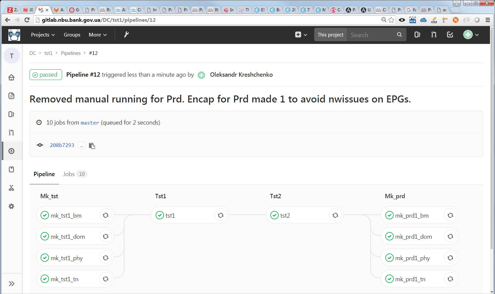

# InfraCodeACI1

This is an example implementation for Infrastructure as Code for Cisco ACI and baremetal linux using Ansible and GitLab CI/CD.

Consider these Ansible playbooks as a template/skeleton/sample that need customization for your particular environment and requirements.

InfraCodeACI2 project is another example with VMware external computing resources.

## Prerequisites

- Working Cisco ACI fabric.
- Account granted an admin role.
- Baremetal linux host.
- Vault`ed passwords placed in host_vars/.
- Ansible configuraion supposedly in $HOME/.ansible.cfg.
- Ansible inventory supposedly in $HOME/.ansible.hosts with appropriate options and group definitions.
- Working GitLab installation with shell runner configured, tagged for ansible, registered, enabled/started and assinged to the project.
- Reflected ansible environment into gitlab-runner home directory (/var/lib/gitlab-runner/ in my case). Proper permissions must be set.

## Topology

Pretty trivial for the sake of cloning and reusing:

- Single APP of two EPGs.
- Single VRF per tenant.
- BD per EPG.
- Contract allowing communication b/w EPGs is common/default.

## Expected result:

for the first simplified version.
